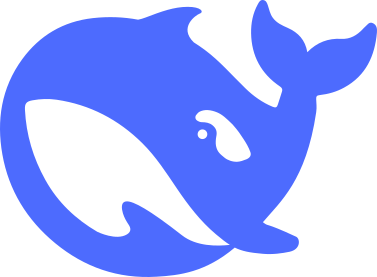

# whale-pet-assets — DeepSeek 鲸鱼动画资源包

从 DeepSeek GUI 桌面应用（`resources\app.asar` → `out/renderer/assets/`）提取的鲸鱼 Logo 动画全套资源，可复用于任何宠物 / 加载动画 / 品牌展示项目。

## 文件

| 文件 | 说明 |
|---|---|
| `whale.svg` | 鲸鱼矢量图（主资源，fill `#4d6bfe`，viewBox 377.1×277.86） |
| `work-logo.css` | 鲸鱼游泳动画样式（从 265KB 全量 CSS 提取的紧凑版，35KB） |
| `demo.html` | 独立演示页：浏览器直接打开，一键切换 待机 ↔ 游泳 |
| `icons/app-icon.png` | DeepSeek GUI 应用图标（鲸鱼） |
| `icons/tray-icon.png` | DeepSeek GUI 托盘图标（鲸鱼） |
| `icons/favicon.svg` | Web 版鲸鱼 favicon（支持暗色模式） |

## 使用方法

`work-logo.css` 是纯 CSS：**19 组 `@keyframes ds-work-logo-*`**（body 身体游泳、tail 尾鳍摇摆、wave 波浪、bubbles 气泡、splash 水花、foam 泡沫、wake 尾迹、gust 阵风、current 暗流、echo 回声、shadow 阴影等），通过容器上的 `--work-logo-*` CSS 变量调参，`is-active` 类触发动画。

需要以下 DOM 结构（demo.html 已内置）：

```html
<span class="ds-work-logo ds-work-logo-md [ds-work-logo-phase-lead|trail] [is-active]">
  <span class="ds-work-logo-gust"></span>
  <span class="ds-work-logo-current"></span>
  <span class="ds-work-logo-swell"></span>
  <span class="ds-work-logo-wave ds-work-logo-wave-back"></span>
  <span class="ds-work-logo-ripple"></span>
  <span class="ds-work-logo-wave ds-work-logo-wave-front"></span>
  <span class="ds-work-logo-breaker"></span>
  <span class="ds-work-logo-wake"></span>
  <span class="ds-work-logo-foam"></span>
  <span class="ds-work-logo-crest"></span>
  <span class="ds-work-logo-splash"></span>
  <span class="ds-work-logo-spray"></span>
  <span class="ds-work-logo-bubbles"></span>
  
  <span class="ds-work-logo-track">
    <span class="ds-work-logo-body">
      
      
    </span>
  </span>
</span>
```

## 状态设计

- **待机（idle）**：不加 `is-active` —— 鲸鱼身体静态可见（`ds-work-logo-image` 默认可见），可自行叠加慢速浮动/尾鳍摆动动画（参考 DeepSeek GUI 宠物版 `pet.css` 中的 `pet-bob` / `pet-tail`）。
- **工作（active）**：加 `is-active` —— 完整游泳动画播放（身体 + 尾鳍分层、波浪、气泡、水花）。
- **尺寸**：`ds-work-logo-sm` / `ds-work-logo-md` / `ds-work-logo-lg` 调整游泳路径幅度。
- **相位**：`ds-work-logo-phase-lead`（默认）/ `ds-work-logo-phase-trail` 调整各层动画延迟。

## 来源

DeepSeek GUI v0.2.8（Electron 应用）内 `AnimatedWorkLogo` React 组件 + `index-*.css`。原版全量 CSS 和组件源码未随包保留，需要时可从 `app.asar` 中重新提取（`out/renderer/assets/index-BrnvgSC-.css`、`Workbench-DDQ5yDrk.js`）。

> 资源版权归 DeepSeek GUI 开源项目（[deepseek-gui.com](https://deepseek-gui.com)，第三方开源项目，非 DeepSeek 官方）原作者所有，原样提取未修改。使用遵循原项目许可证（以原仓库 LICENSE 为准），本目录仅作学习/个人非商业用途。
